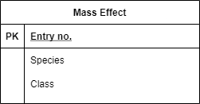

# QA Practical Project

## Contents
* [Introduction](#introduction)
    * [Project Specification](#project-specification)
    * [Proposal](#proposal)
* [Architecture](#architecture)
    * [Kanban Board](#kanban-board)
    * [Risk Assessment](#risk-assessment)
* [Infrastructure](#infrastructure)
    * [Service Configuration](#service-configuration)
    * [Entity Relation Diagram](#entity-relation-diagram)
    * [Project Pipeline](#project-pipeline)
    * [Jenkins](#jenkins)
    * [VM configuration](#vm-configuration)
* [Developement and Deployment](#developement-and-deployment)
    * [Test Reports](#test-reports)
    * [Front-end](#front-end)

## Introduction

### Project Specification
The project specification states that we need to design an app that is made up of at least 4 services running in unison and is to be deployed in a swarm through a CD/CI pipeline. Services 2 and 3 must randomly generate an object, service 4 must create an object based on services 2 and 3 using pre-defined rules and service 1 is the core service that acts as the apps' frontend. It must effectively communicate with the other 3 services and persist some data in an SQL database.

The project specification also states that the following technologies must be utilised:
- Kanban Board: Asana or an equivalent Kanban Board
- Version Control: Git
- CI Server: Jenkins
- Configuration Management: Ansible
- Cloud server: GCP virtual machines
- Containerisation: Docker
- Orchestration Tool: Docker Swarm
- Reverse Proxy: NGINX

### Proposal
For this project I have decided to make an app that generates characters for the sci-fi video game Mass Effect. Service 2 and 3 generate the characters' species and class respectively. Service 4 creates some stats for the character based on the previous two attributes and service 1 displays the charcters' species, class and their stats, with the characters' species and class being stored in an external SQL database.

## Architecture

### Kanban Board

I chose Trello to create my Kanban board and hence to plan my project due to it being free, I was already familiar with the app and its strong visual interface.

A screenshot of my Trello board:

Trello board can be accessed [here](https://trello.com/b/CTxgd71J/qa-project-2)

### Risk Assessment

Screenshot of my risk assessment:

Full risk assessment available [here](https://onedrive.live.com/edit.aspx?resid=2999F3BD7781D9A6!127&ithint=file%2cxlsx&wdOrigin=OFFICECOM-WEB.START.MRU).

## Infrastructure

### Service Configuration

The app conists of a total of five services; the 4 core services defined in the project specification and an nginx proxy server and they interact with each other as shown in the diagram below:

The core service (service 1) sends get requests to services 2 and 3 and a post request to service 4. Service 1 then sends data to be stored in an SQL database and finally, the nginx service acts as a proxy server that allows users to access the frontend through port 80. 

### Entity Relation Diagram

For this project only one table was required with no relationships. The entity relation diagram ended up looking like this:

### Jenkins

Jenkins allowed for the project to be deployed through a continous integration and deployment pipeline. The project was built as a Jenkins pipeline project with a github webhook and a Jenkinsfile which consisted of four stages:
- Build stage
> Builds all the images that are needed for the app to run, namely the 4 core services and the nginx proxy server
- Test stage
> Test the four core services and display a coverage report along with any lines that were missing. Results of the tests can be found [here](#test-reports)
- Push stage
> Pushes the images built in stage 1 to Dockerhub
- Deploy stage
> Deploys the application as a stack on the manager node

(Docker was installed on the relevant machines and swarm initialised with ansible before Jenkins deployment)

### VM  Configuration

Originally I proposed 3 VMs to run this project in the following configuration:
- 'Prime' VM: 
> - Uses ansible to install docker on the manager and worker machines and configures the swarm.
> - Jenkins then deploys app on the manager node. 
- Manager VM:
> Acts as the manager of the swarm.
- Worker VM:
> Worker node in the swarm.

The final configuration consisted of only 2 VMs with the prime VM also being the manager of the swarm. This was due to time constraints and also the cost of running 3 separate VMs simultaneously. A diagram of the two different configurations can be seen below:

### Project Pipeline

Bringing everything together, the entire project pipeline is shown below:

## Developement and Deployment

### Test Reports

Each of the four core services were tested with results listed below:

- Service 1 (server):   Coverage: 95%   Line(s) missing: 29
- Service 2 (class_api):    Coverage: 86%   Line(s) missing: 12
- Service 3 (species_api):    Coverage: 86%   Line(s) missing: 11
- Service 4 (stats_api):    Coverage: 97%   Line(s) missing: 40

This gives us a total coverage in excess of 90% and in each case the only line that was missing was the line below:
> app.run(host="0.0.0.0", port=5000, debug=True)
This was because the preceding 'if __name__ == "__main__":' statement is evaluated to false in a test environment, hence the follwong lines were not tested.

### Front-end

The web-page can be navigated to through port 80 on either manager or worker nodes, the information is displayed as below. The page is rendered with HTML Jinja 2 templates.

